# 实验室项目笔记

## 研究内容

研究电力物联设备通信协议分类模型的智能化快速构建方法。采用人工智能算法建立电力物联设备通讯协议分类模型，确定协议的通信交互模型。

（机器学习分类通讯协议）

| 算法           | 模型                   |
| -------------- | ---------------------- |
| 无监督学习算法 | 通讯协议报文的训练模型 |
| 强化学习算法   | 报文数据动态划分模型   |

## 创新点

（1）构建基于无监督学习的电力物联网快速协议报文数据包划分模型；

（2）构建基于强化学习的动态报文数据包划分模型；

（3）建立电力物联设备通信协议模型的智能化快速构建方法。

## 自注意力机制

$$
Attention(Q,K,V) = softmax(\frac{QK^T}{\sqrt{d_k}})V
$$

(1)式为自注意力公式

Q,K,V 分别是我们的查询、键、值

Q就可以理解我们所需要查找的目标的特征

K就是各个目标的特征

V则是用来进行加权的
$$
QK^T
$$
$QK^T$是两个向量的内积，而两个向量的内积，表征一个向量在另一个向量上的投影，计算出来的投影值越大，就证明两个向量相关度高，就有可能是我们所寻找的对象。
$$
softmax()
$$
$softmax$则是进行归一化,从而进行权值的分配，最后乘以$V$就是加权求和后的表示。

# PyDatalog

## 基础语法

### 定义变量

```python
pyDatalog.create_terms('X,Y,factorial')#定义变量
```

### 制定逻辑

```py
factorial[X] = X*factorial[X-1]#制定factorial逻辑
factorial[1] = 1#给特定的值赋值
```

### 引入函数

```python
import math
pyDatalog.create_terms('math')#pyDatalog想要使用原有函数需要提前定义
print((X==2) & (Y==math.sqrt(X)))
```

### 输出

```python
print(factorial[3]==X)#需要借助特定的变量来输出
```


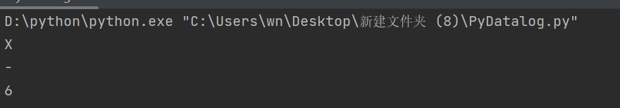


```python
print((X==True) & (Y==False))#查询两个结果使用&链接
```

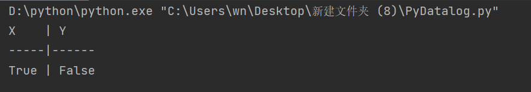

```python
print(X.in_(range(5)) & (X<2))#&可以来限制输出条件
```

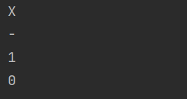

```python
print(X.data)#输出X的所有内容
```

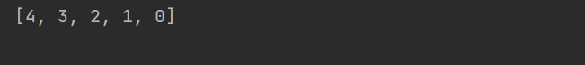

### 循环

```python
print(X.in_((0,1,2,3,4)))#使用in来进行循环
print(X.in_(range(5)))
```

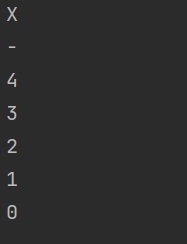

```python
print(X.in_(range(5)) & Y.in_(range(5)) & (Z==X+Y) & (Z<2))#两个变量同时循环相当于双重循环
```

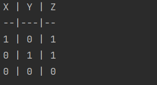

### 逻辑函数和字典

```python
from pyDatalog import pyDatalog
pyDatalog.create_terms('X,Y,Z, money')
money['jack'] = 600
money['siri'] = 110#建立数据库表money
# give me all the X and Y so that the salary of X is Y
print(money[X]==Y)#以X为用户名，Y为用户所存储钱数
```

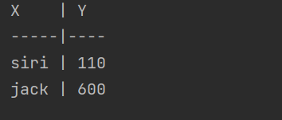

```python
print(money[X]==110)#表也可以按值查询
```

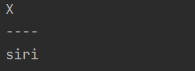


```python
print((money[X]==Y) & ~(Y==110)) #可以对查询值进行限制
```

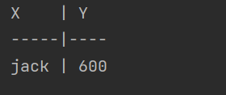

```python
+(tax_rate[None]==0.33)#可以用None作为键值设置一些常量,需要使用+(...)来定义
print((Z==money[X]*(1-tax_rate[None])))# 可以在查询时使用函数来进行运算
```

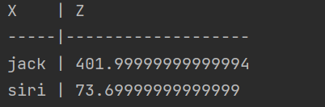

```python
(tax[X] == 0.3) <= (0<=X)#使用约束可以根据键值来进行划分
(tax[X] == 0.5) <= (100<=X)
中间的<=可以视为if，并且约束的执行是从最后定义的约束向前执行，要先执行更具体的规则，并在找到有效答案后停止
```

### 聚合函数

暂未理解

### 字面值和集合

```python
from pyDatalog import pyDatalog
pyDatalog.create_terms('X,Y,Z, workers，manager')
+workers('mi','header')
+workers('li','header')
+workers('ni','worker')#相当于向workers表添加了三项内容
-workers('ni','worker')#可以进行删除
print(workers(X,'header'))#查询为header的人名
+()定义的要使用workers(,)查询,workers[X]==Y则可以用workers[X]==Y查询
```

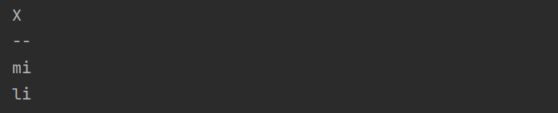

```py
from pyDatalog import pyDatalog
pyDatalog.create_terms('X,Y,Z, workers,manager,indirect_manager')
manager['John'] = 'Mary'
manager['Mary'] = 'John'
indirect_manager(X,Y) <= (manager[X] == Y)
indirect_manager(X,Y) <= (manager[X] == Z) & indirect_manager(Z,Y)
print(indirect_manager('John',X))#会保留中间结果
```

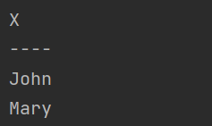

### 树，图，与递归算法

```python
from pyDatalog import pyDatalog
pyDatalog.create_terms('X,Y,Z,link,can_reach')
+link(1, 2)
+link(2, 3)
+link(2, 4)
+link(2, 5)
+link(5, 6)
+link(6, 7)
+link(7, 2)

#双线连接图规则
link(X, Y) <= link(Y, X)  # 首先设置双向链接约束
can_reach(X, Y) <= link(X, Y)  # 代表X到Y可达
can_reach(X, Y) <= link(X, Z) & can_reach(Z, Y) & (X != Y)  # 通过两点间接可达

print (can_reach(1,Y))
只需要在定义之后设置好规则即可实现完整逻辑，规则先后不影响结果，理解为会进行循环执行直到没有满足条件的结果为止。
datalog只要将所要实现的问题规则制定好即可实现该问题
```

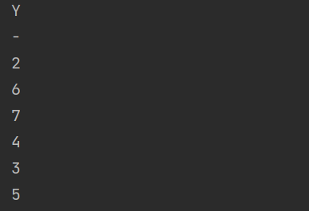

# Reverse

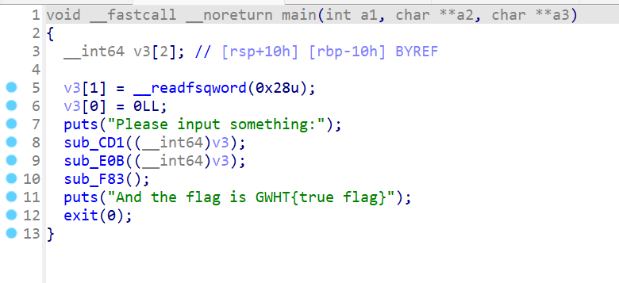

打开程序可以看见三个函数

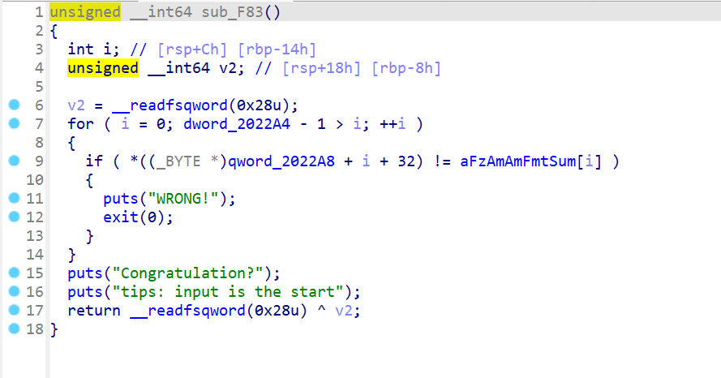

sub_F83打开后可以看出来是典型的验证函数，则前两个函数为加密函数，

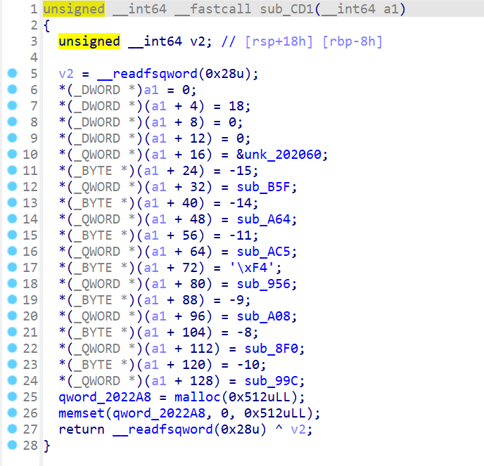

做这种题目的第一步就是要找到指令变量 寄存器变量 和 栈变量这三块地址，我们可以看见在这个函数中它给每个位置分配一个数之后在后面分配一个函数，所以我们可以认为前面的数是函数的操作码，然后我们打开unk_202060后可以看见许多操作码，则unk_202060存储着程序操作码

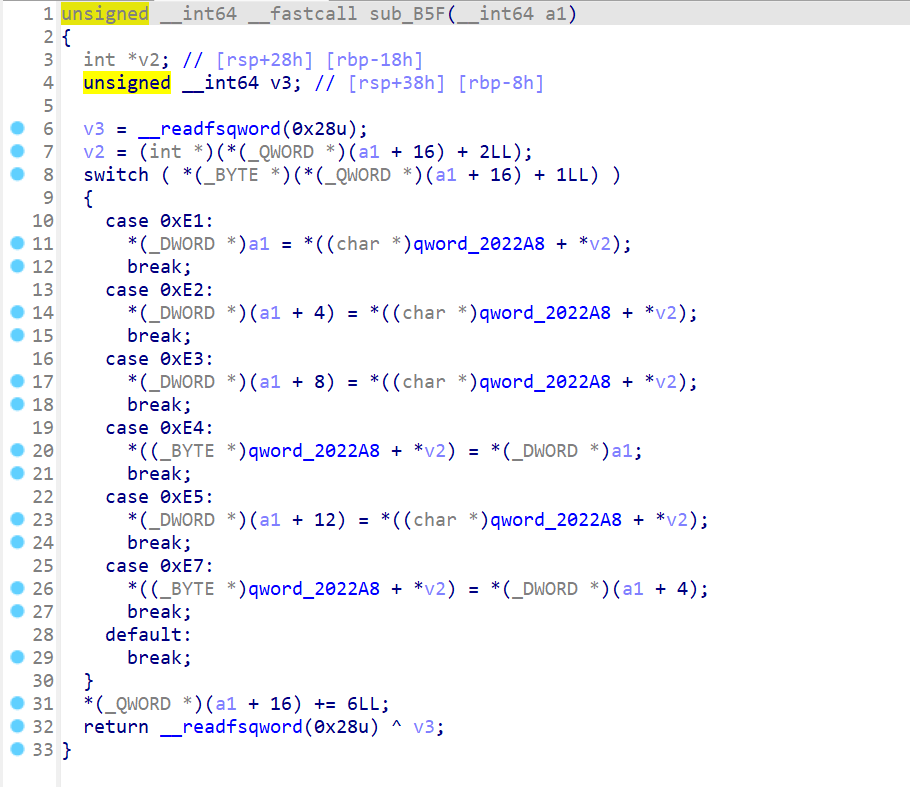

sub_B5F中则根据*(a1+16)处的值向多处进行数据存取可以认为E1等数为寄存器的标记值，用来标记内存单元2022A8和多处寄存器的存取

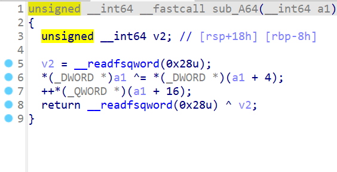

sub_A64是进行一个异或

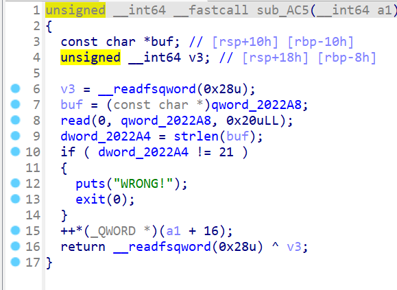

sub_AC5是开辟空间，读取输入获取长度

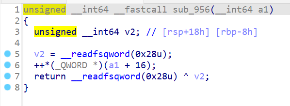

sub_956则是nop

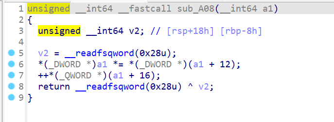

sub_A08则是两个操作数相乘

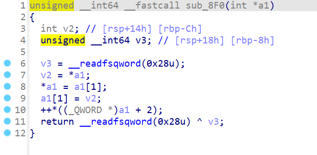

sub_8F0则是swap函数

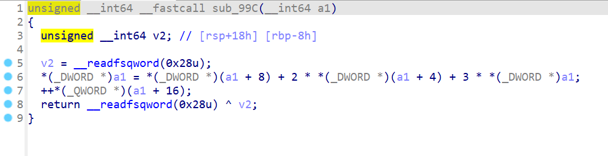

sub_99C则是一个计算公式

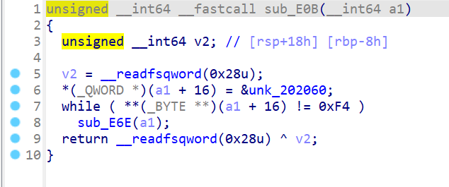

sub_E0B是循环执行unk_202060每条命令

```python
0xf5,#read(0,buf,0x20)
	0xf1,0xe1,0x0,0x0,0x0,0x0,#r1 = flag[0]
	0xf1,0xe2,0x1,0x0,0x0,0x0,#r2 = flag[1]
	0xf2,#r1 = r1^r2
	0xf1,0xe4,0x0,0x0,0x0,0x0,#stack[0] = r1
	
	0xf1,0xe1,0x1,0x0,0x0,0x0,#r1 = flag[1]
	0xf1,0xe2,0x2,0x0,0x0,0x0,#r2 = flag[2]
	0xf2,#r1 = r1^r2
	0xf1,0xe4,0x1,0x0,0x0,0x0,#stack[1] = r1
	
	0xf1,0xe1,0x2,0x0,0x0,0x0,#r1 = flag[2]
	0xf1,0xe2,0x3,0x0,0x0,0x0,#r2 = flag[3]
	0xf2,#r1 = r1^r2
	0xf1,0xe4,0x2,0x0,0x0,0x0,#stack[2] = r1

	0xf1,0xe1,0x3,0x0,0x0,0x0,#r1 = flag[3]
	0xf1,0xe2,0x4,0x0,0x0,0x0,#r2 = flag[4]
	0xf2,#r1 = r1^r2
	0xf1,0xe4,0x3,0x0,0x0,0x0,#stack[3] = r1

	0xf1,0xe1,0x4,0x0,0x0,0x0,#r1 = flag[4]
	0xf1,0xe2,0x5,0x0,0x0,0x0,#r2 = flag[5]
	0xf2,#r1 = r1^r2
	0xf1,0xe4,0x4,0x0,0x0,0x0,#stack[4] = r1

	0xf1,0xe1,0x5,0x0,0x0,0x0,#r1 = flag[5]
	0xf1,0xe2,0x6,0x0,0x0,0x0,#r2 = flag[6]
	0xf2,#r1 = r1^r2
	0xf1,0xe4,0x5,0x0,0x0,0x0,#stack[5] = r1

	0xf1,0xe1,0x6,0x0,0x0,0x0,#r1 = flag[6]
	0xf1,0xe2,0x7,0x0,0x0,0x0,#r2 = flag[7]
	0xf1,0xe3,0x8,0x0,0x0,0x0,#r3 = flag[8]
	0xf1,0xe5,0xC,0x0,0x0,0x0,#r4 = flag[12]
	0xf6, #r1 = (3*r1+2*r2+r3)
	0xf7, #r1 = r1*r4
	0xf1,0xe4,0x6,0x0,0x0,0x0,#stack[6] = r1

	0xf1,0xe1,0x7,0x0,0x0,0x0,#r1 = flag[7]
	0xf1,0xe2,0x8,0x0,0x0,0x0,#r2 = flag[8]
	0xf1,0xe3,0x9,0x0,0x0,0x0,#r3 = flag[9]
	0xf1,0xe5,0xC,0x0,0x0,0x0,#r4 = flag[12]
	0xf6, #r1 = (3*r1+2*r2+r3)
	0xf7, #r1 = r1*r4
	0xf1,0xe4,0x7,0x0,0x0,0x0,#stack[7] = r1

	0xf1,0xe1,0x8,0x0,0x0,0x0,#r1 = flag[8]
	0xf1,0xe2,0x9,0x0,0x0,0x0,#r2 = flag[9]
	0xf1,0xe3,0xA,0x0,0x0,0x0,#r3 = flag[10]
	0xf1,0xe5,0xC,0x0,0x0,0x0,#r4 = flag[12]
	0xf6, #r1 = (3*r1+2*r2+r3)
	0xf7, #r1 = r1*r4
	0xf1,0xe4,0x8,0x0,0x0,0x0,#stack[8] = r1

	0xf1,0xe1,0xD,0x0,0x0,0x0,#r1 = flag[13]
	0xf1,0xe2,0x13,0x0,0x0,0x0,#r2 = flag[19]
	0xf8,#r1 = r2,r2 = r1
	0xf1,0xe4,0xD,0x0,0x0,0x0,#stack[13] = r1
	0xf1,0xe7,0x13,0x0,0x0,0x0,#stack[19] = r2

	0xf1,0xe1,0xE,0x0,0x0,0x0,#r1 = flag[14]
	0xf1,0xe2,0x12,0x0,0x0,0x0,#r2 = flag[18]
	0xf8,#r1 = r2,r2 = r1
	0xf1,0xe4,0xE,0x0,0x0,0x0,#stack[14] = r1
	0xf1,0xe7,0x12,0x0,0x0,0x0,#stack[18] = r2

	0xf1,0xe1,0xF,0x0,0x0,0x0,#r1 = flag[15]
	0xf1,0xe2,0x11,0x0,0x0,0x0,#r2 = flag[17]
	0xf8,#r1 = r2,r2 = r1
	0xf1,0xe4,0xF,0x0,0x0,0x0,#stack[15] = r1
	0xf1,0xe7,0x11,0x0,0x0,0x0,#stack[17] = r2
	0xf4#ret

```

从这里我们可以看出程序的逻辑，即可用最终的数据逆序处理得到flag

```python
from z3 import *
def swap(a,b):
    a,b=b,a
    return a,b

byte=[0x69, 0x45, 0x2A, 0x37, 0x09, 0x17, 0xC5, 0x0B, 0x5C, 0x72,
  0x33, 0x76, 0x33, 0x21, 0x74, 0x31, 0x5F, 0x33, 0x73, 0x72,
  0x00, 0x00, 0x00, 0x00, 0x00, 0x00, 0x00, 0x00, 0x00, 0x00,
  0x00, 0x00]

a = Real('a')
b = Real('b')
c = Real('c')

byte[15],byte[17]=swap(byte[15],byte[17])
byte[14],byte[18]=swap(byte[14],byte[18])
byte[13],byte[19]=swap(byte[13],byte[19])

solve((3 * a + 2 * b + c) * 0x33 == 0x6dc5, (3 * b + 2 * c + 0x72) * 0x33 == 0x5b0b,(3 * c + 2 * 0x72 + 0x33) * 0x33 == 0x705c)

byte[6] = 118#a
byte[7] = 51#b
byte[8] = 95#c
for i in range(6):
     byte[5-i] ^= byte[5-i+1]

flag = ''
for i in range(32):
    flag += chr(byte[i])
print(flag)
```

