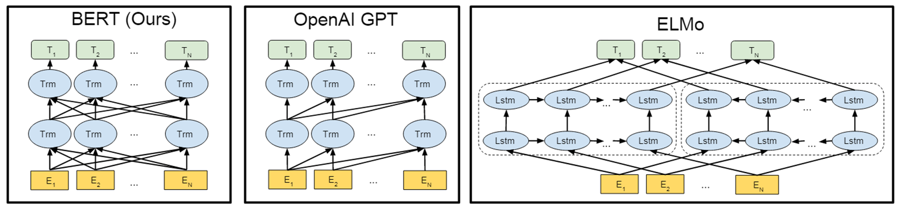
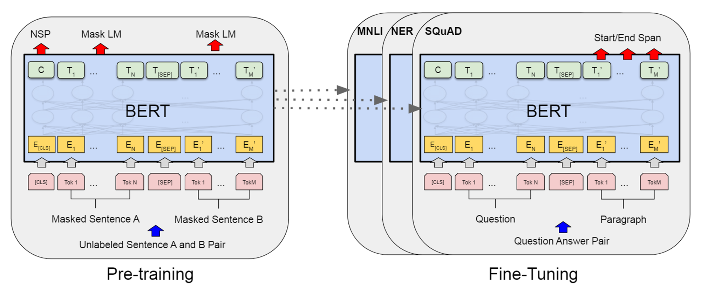
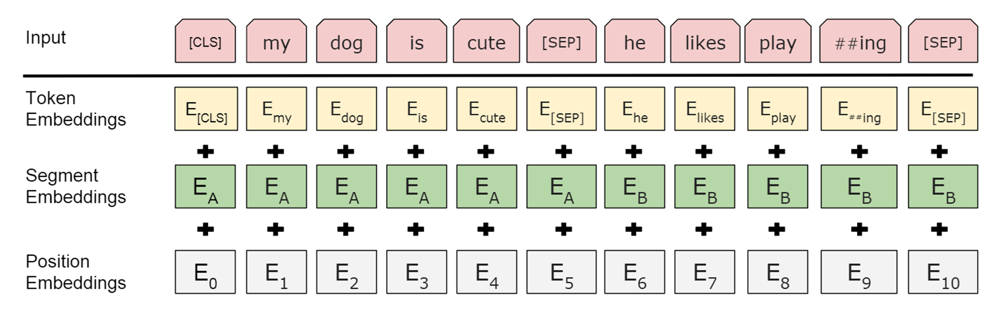
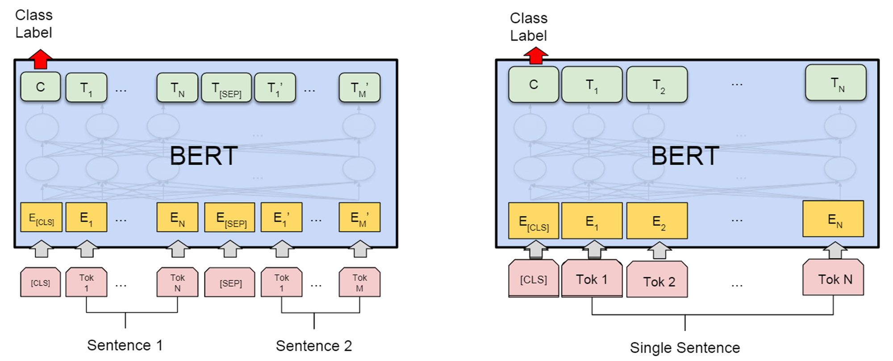
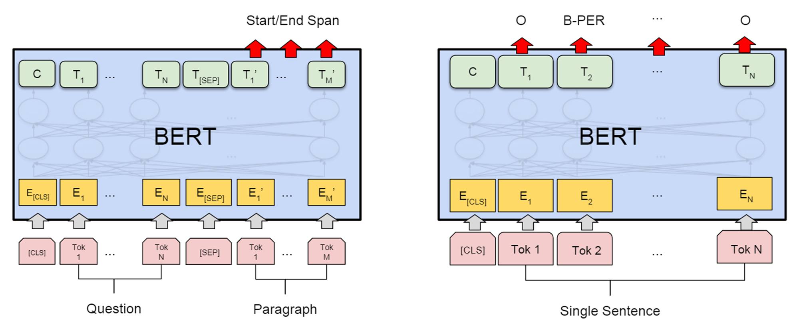

# 2024-1-26

## BERT Pre-training of Deep Bidirectional Transformers for Language Understanding

### 工作摘要

该论文提出了BERT模型，继GPT模型后将自注意力模型架构用于双向语言模型。相对于预训练单向语言模型，双向语言模型经预训练后能够更好地适配自然语言理解任务。

下图展示了BERT模型、GPT模型、ELMo模型之间的设计差异。

关于模型预训练，该论文正式提出了掩码建模预训练方法(Masked LM, MLM)，并在预训练过程中同时使用了下句判断(Next Sentence Prediction, NSP)。在大规模语料库完成无监督预训练的基础上，在下游任务上微调后得到的BERT模型具有强大的性能。通过消融研究，该论文对比了不同预训练方法设计的差异以及模型规模的影响。

### 论文思路

#### ELMo模型

NLP领域中，模型通过半监督学习使用无标注数据进行大规模的预训练，能够具有有效特征提取的能力。在这一过程中，模型所做的工作实际为尽量拟合语料库中词元的真实分布，因此语言建模作为预训练任务显然是简单粗暴且行之有效的。

$$
LM(w_1,...,w_{n-1}) = arg_{w_n}max\,p(w_n|w_{n-1},...,w_1)
$$

然而对于自然语言理解任务，对于某一词元的具体理解往往需要同时考虑该词元左右两边的其他词元信息，但语言建模任务中每个词元仅关注该词元之前的词元内容，即语言建模任务中的模型是单向的。为此，该论文使用双向语言模型进行预训练，使得模型在对每个词元进行特征提取时同时考虑其左右两边的内容。

$$
BiLM(w_1,...,w_{t-1},[MASK],w_{t+1},...,w_n)=arg_{w_i}max\,p(w_t|w_n,...,w_{t+1},w_{t-1},...,w_1)
$$

事实上，word2vec、ELMo等工作均为双向语言模型的思路，其中word2vec工作中CBOW得到的词向量仅考虑给定词元前后固定个数的其他词元，且不能够根据上下文的实际语境调整，而ELMo提取得到的词向量上下文有关，且由于使用LSTM，理论上可以考虑前后无限个词元的信息。在该论文中，对于双向语言建模，正式提出了掩码建模预训练方法(Masked LM, MLM)，并且在模型使用方面借鉴了GPT模型为输入添加特定引导标签的做法。

另外，由于自然语言推理等NLU任务需要考虑句与句之间的关系，该论文在预训练过程中同时设计了下句判断这种预训练任务，即令模型判断给定的两句话是否为上下句关系。

BERT模型，与GPT模型均采用了自注意力模型架构，原理如下式所示。其中输入词元为 $\vec{x_1},...,\vec{x_n}$ ， $d_k$ 表示单个 $\vec{q_i}、\vec{k_i}$ 向量的维数，   $softmax$ 函数对输入矩阵的处理为按列完成归一化。

$$ 
Q=[\vec{q_1},...,\vec{q_n}]\,\,\,\, , \,\,\,\, \vec{q_i}=W_q\vec{x_i}
\\
K=[\vec{k_1},...,\vec{k_n}]\,\,\,\, , \,\,\,\, \vec{k_i}=W_k\vec{x_i}
\\
V=[\vec{v_1},...,\vec{v_n}]\,\,\,\, , \,\,\,\, \vec{v_i}=W_v\vec{x_i}
\\Attention(Q,K,V,Mask)=V(softmax(\frac{Mask\odot(K^TQ)}{\sqrt{d_k}}))

$$

与GPT模型不同之处在于，GPT模型被设计为一个单向语言模型，即任意词元在进行特征提取时应当不可见该词元的后续词元，故在GPT模型中  $Mask$  矩阵为一个上三角矩阵，其中上半部分均为1；BERT模型为双向语言模型，每个词元均可见全部输入词元，因此BERT模型中 $Mask$  矩阵为全1矩阵。

为增强模型使用的灵活性，BERT模型同样采用了在输入中添加引导标签以表达特殊含义的做法。例如整个输入的总领标签  $[CLS]$  、句子之间的分隔标签  $[SEP]$  等。为区分不同句子，BERT模型除使用分隔标签以外还对不同句子使用了不同的句子嵌入表示，即每个词元的嵌入表示为该词元自身嵌入、该词元所在句子嵌入、词元位置嵌入这三者的加和结果。

#### 模型预训练

BERT模型在预训练过程中使用了掩码建模(Masked LM, MLM)的预训练方法，即令模型还原被遮挡的词元。

BERT使用自注意力模型架构，遮挡词元的还原过程可根据实际输入参照该词元前后任意个数的其他词元，因此被遮挡词元需要一个占位符。在应用中BERT模型对于被遮挡的词元使用引导标签  $[MASK]$  进行占位。该模型既可以在完全不可见该词元的情况下尽可能还原出该词元，也使得模型具有判别给定位置的词元是否合理的能力。

掩码建模训练过程中，将模型对某个词元 $token_k$ 的特征提取输出接入 $softmax$ 分类器，得到该词元在词表中各种可能的取值概率 $\vec{y_k}$ ，将其与表示实际取值的独热向量 $\vec{y_k}$ 作交叉熵损失。

$$
L = -\vec{y^{'}_k}log(\vec{y_k})
$$

因很多自然语言理解任务需要考虑句与句之间的关系，BERT模型设计了下句判断的预训练方法。具体而言，将一组句子对输入BERT模型后，经特征提取得到的每个词向量会受到全部词元语义的影响，此时将不具备实际语义的总领标签 
 $[CLS]$ 对应的词向量输出接入分类器进行二分类，判断输入语句是否为连贯的两句，以增强模型对不同语句之间关系的特征提取能力

#### 模型微调

BERT模型使用了基于微调的方法，在适配下游任务时，BERT模型将与一个额外的随机初始化的输出层结合，模型的全部参数均将得到更新。

BERT模型经微调后可适配于各种自然语言理解任务。对于自然语言推理、文本蕴含、语义相似性判别、语义等价判别等针对句子对的分类任务，可使用总领标签 $[CLS]$ 对应的词向量输出进行分类。对于语言可接受性判别、语句级情感分类等单句分类任务同理。下图分别展示了BERT模型在句子对分类和句子分类任务上的使用示意。

在阅读理解任务中，对于给定段落和给定问题，为使用区间的方式表示出给定段落中的有效文本，将BERT模型对给定段落的每个词向量输出分别作两次二分类，即是否为有效文本起始词元、是否为有效文本终止词元，如下图左图所示。若存在给定段落中不存在答案的情况，可使用总领标签 $[CLS]$ 对应的词向量用作判别答案是否存在的依据。

类似地，对于同样为词元级分类任务的语义角色标注等任务，将BERT模型输出的词向量逐一送入分类器即可，如下图所示。

### idea

1.采用预训练双向模型如BERT等来进行协议分类，将现有模型的结构进行魔改，添加交叉注意力机制并进行堆叠，然后再使用分类器进行二次分类

2.使用掩码建模方式增强模型分类能力

3.添加特定引导标签来增强分类能力
