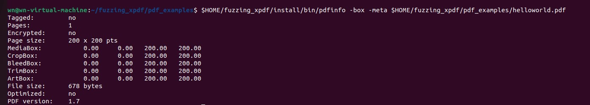

# Exercise 1 - Xpdf

## 搭建测试目标Xpdf

首先为fuzz测试xpdf创建文件夹

```
cd $HOME
mkdir fuzzing_xpdf && cd fuzzing_xpdf/
```

准备编译c/c++所需要的软件包

```
sudo apt install build-essential
```

下载并编译Xpdf3.02

```
wget https://dl.xpdfreader.com/old/xpdf-3.02.tar.gz
tar -xvzf xpdf-3.02.tar.gz
cd xpdf-3.02
sudo apt update && sudo apt install -y build-essential gcc
./configure --prefix="$HOME/fuzzing_xpdf/install/"
make
make install
```

如果git失败，无法连接则输入下列命令取消代理

```
git config --global --unset https.proxy
git config --global --unset http.proxy
```

接着为fuzz测试准备测试例子

```
cd $HOME/fuzzing_xpdf
mkdir pdf_examples && cd pdf_examples
wget https://github.com/mozilla/pdf.js-sample-files/raw/master/helloworld.pdf
wget http://www.africau.edu/images/default/sample.pdf
wget https://www.melbpc.org.au/wp-content/uploads/2017/10/small-example-pdf-file.pdf
```

然后我们测试一下安装的pdfinfo

```
$HOME/fuzzing_xpdf/install/bin/pdfinfo -box -meta $HOME/fuzzing_xpdf/pdf_examples/helloworld.pdf
```



接下来安装AFL++测试软件

```
sudo apt-get update
sudo apt-get install -y build-essential python3-dev automake git flex bison libglib2.0-dev libpixman-1-dev python3-setuptools
sudo apt-get install -y lld-11 llvm-11 llvm-11-dev clang-11 || sudo apt-get install -y lld llvm llvm-dev clang 
sudo apt-get install -y gcc-$(gcc --version|head -n1|sed 's/.* //'|sed 's/\..*//')-plugin-dev libstdc++-$(gcc --version|head -n1|sed 's/.* //'|sed 's/\..*//')-dev
```

输入afl-fuzz测试是否安装成功


我们要使用AFL++更好的测试Xpdf就要进行插桩，利用afl-gcc重新编译，实现对分支覆盖率的捕获，以及分支节点计数。首先要清除之前编译过的。

```
rm -r $HOME/fuzzing_xpdf/install
cd $HOME/fuzzing_xpdf/xpdf-3.02/
make clean
```

现在使用afl-clang-fast编译器构建xpdf:

```
export LLVM_CONFIG="llvm-config-11"
CC=$HOME/AFLplusplus/afl-clang-fast CXX=$HOME/AFLplusplus/afl-clang-fast++ ./configure --prefix="$HOME/fuzzing_xpdf/install/"
make
make install
```

然后我们运行fuzz进行测试

```
afl-fuzz -i $HOME/fuzzing_xpdf/pdf_examples/ -o $HOME/fuzzing_xpdf/out/ -s 123 -- $HOME/fuzzing_xpdf/install/bin/pdftotext @@ $HOME/fuzzing_xpdf/output
```

如果出现"Hmm, your system is configured to send core dump notifications to an external utility..."则输入

```
sudo su
echo core >/proc/sys/kernel/core_pattern
exit
```

如果出现下列情况，则证明插桩出现问题，可以使用-n或者重新插桩


成功之后我们运行AFL，我们发现一个cash后退出，进入HOME/fuzzing_xpdf/out/查看输出的cash样例信息


找到cash样例后我们打开gdb进行调试，首先下入多个断点，将样例作为输入，运行后会出现segmentation fault错误


接着我们输入bt查看报错堆栈


我们可以发现多次调用了Parser::getObj，陷入了无限递归调用中，由于递归调用无法结束所以堆栈无法清理，最终导致栈溢出。
